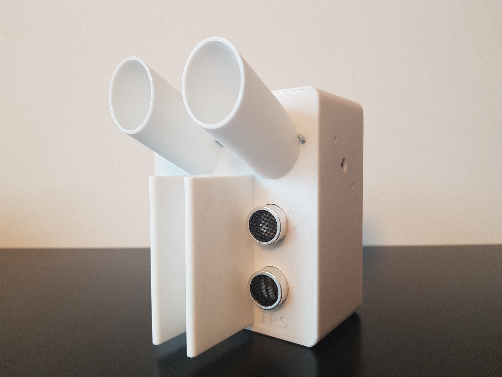
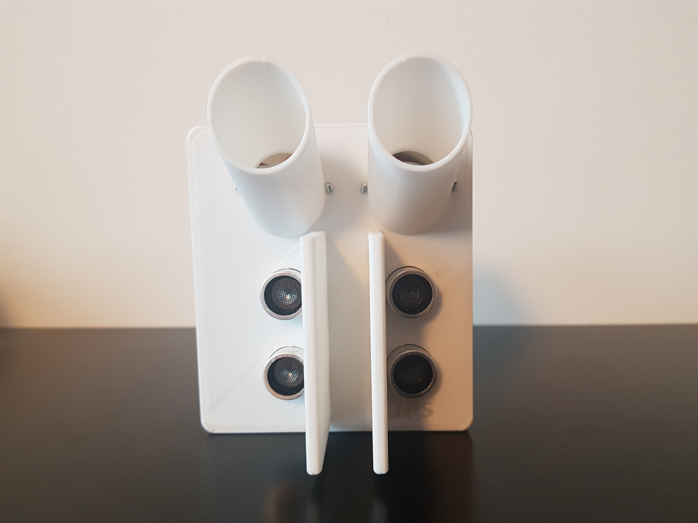
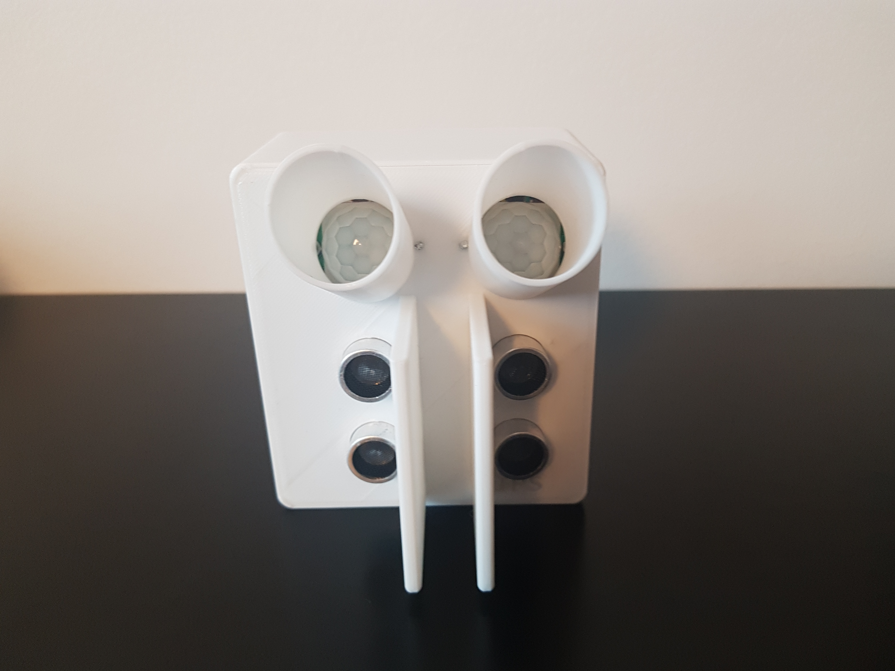
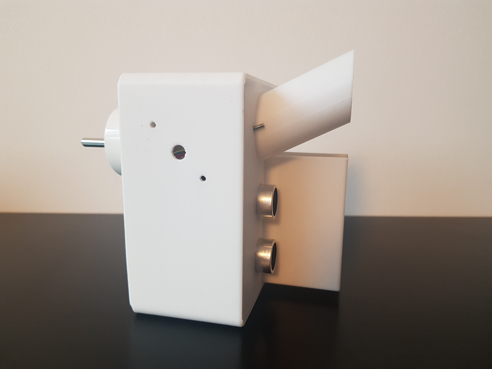
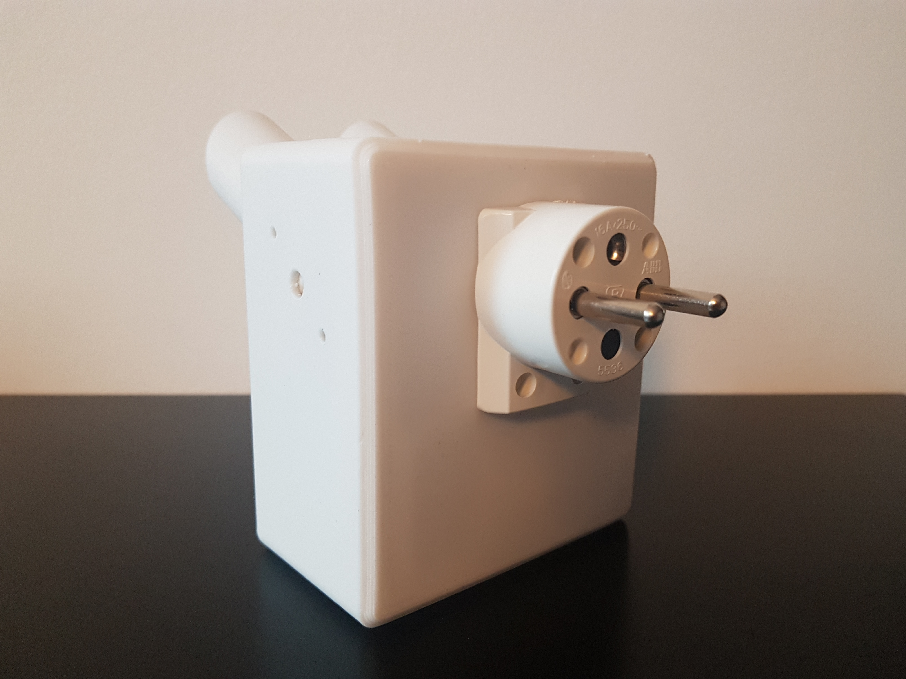
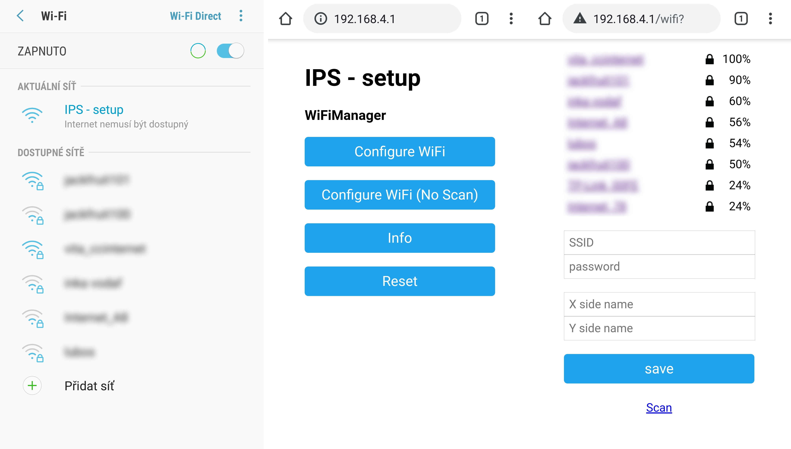

# Indoor_Positioning_System

### README

The main code is divided into 5 files. 
* *main.cpp* in the "src" folder
* *HomeAssistant.cpp* and *IPS.cpp* in the "lib" folder
* *HomeAssistant.h* and *IPS.h* in the "include" folder

#### Home Assistant

In this section of code, the support for Home Assistant automation system is implemented. 

#### IPS

This section handles the "pass detection" itself. It also deals with connecting the device to Wi-Fi network.

### Prototype pictures

### Initial setup

* The user has to connect to ESP8266 with his WiFi enabled device. 

* The user then navigates to 192.168.4.1 IP address, where a menu web page is presented. 

* Choosing the "Configure WiFi" option, the user is presented with following menu. Here the user has to pick an SSID and enter WiFi password as well as enter the names of both of the X and Y sides of the device, such as  X: LivingRoom Y: Hallway

* Hitting "save" option will end the configuration process. 
In the Home Assistant app, user is then able to add both LivingRoom and Hallway cards to monitor the number of people in those rooms. The user is then free to create any automation in Home Assistant with these entities.

### Technical info
* The program tries to load both WiFi login credentials and side X, sideY names from flash memory (SPIFFS). If it fails to load any of those, ESP8266 puts itself into AP mode. If it succeeds with loading needed data, ESP8266 automatically connects to WiFi and sends configuration message to HomeAssistant (<a href="https://www.home-assistant.io/docs/mqtt/discovery/">MQTT Discovery</a>). 

* After fetching needed data, the WiFiManager library deals with storing WiFi login credentials and connecting to WiFi. Names of both  X and Y sides have to be manually saved into SPIFFS file system. They are saved in "/sides.json" file, using the json format.

* Using the X and Y side names, MQTT publish topic names are created. The resultant publish topics are IPS/"side_x_name" and IPS/"side_y_name". The goal is to have one publish topic per room (or area). This way, more than one device can publish into the same topic. This approach is necessery in situations where one room has multiple doorways.

* In order to find an IP address of a MQTT broker (HomeAssistant server), mDNS protocol is used. ESP8266 sends a query for "hassio.local" hostname. The resolved IP address is then used as an MQTT broker address.
